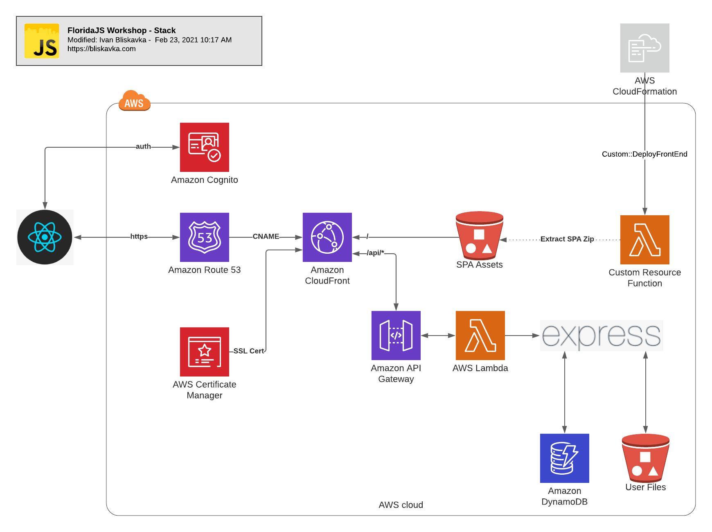
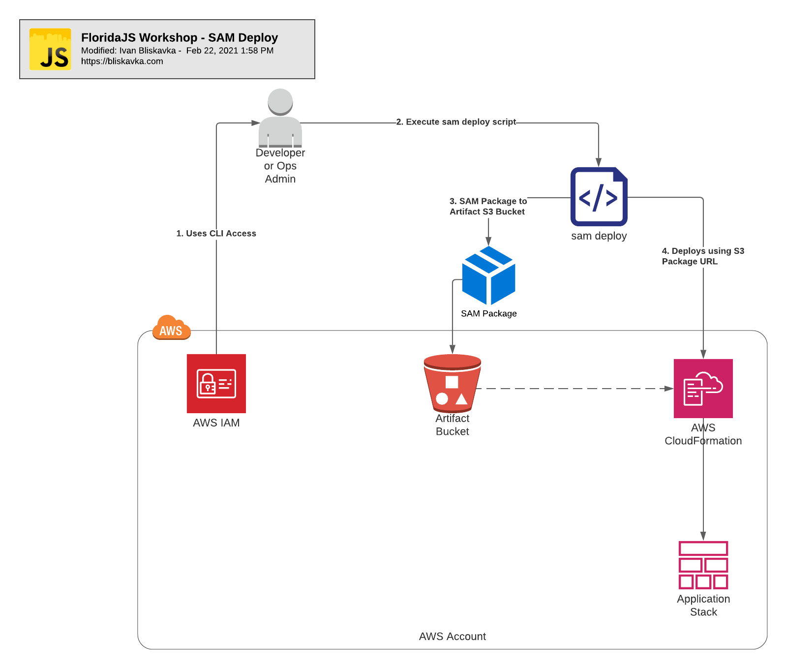
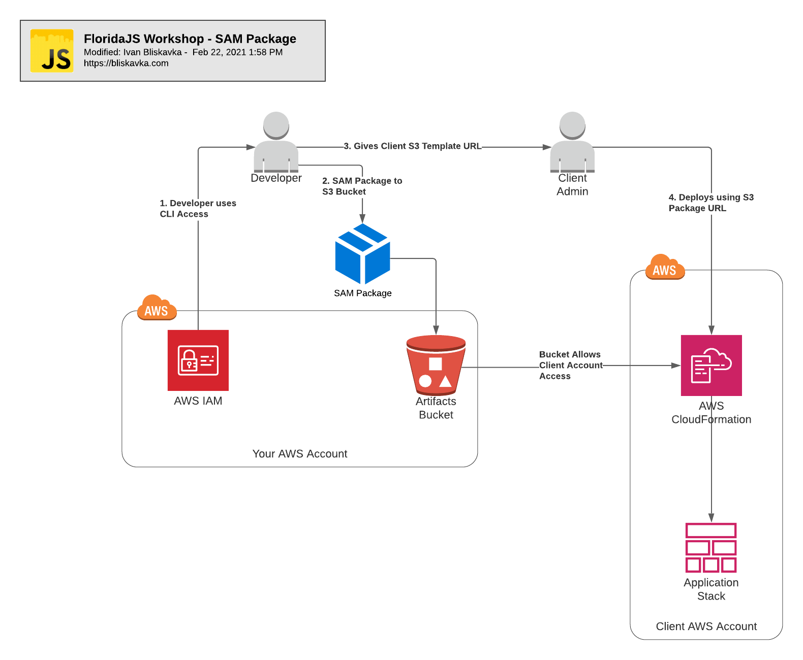
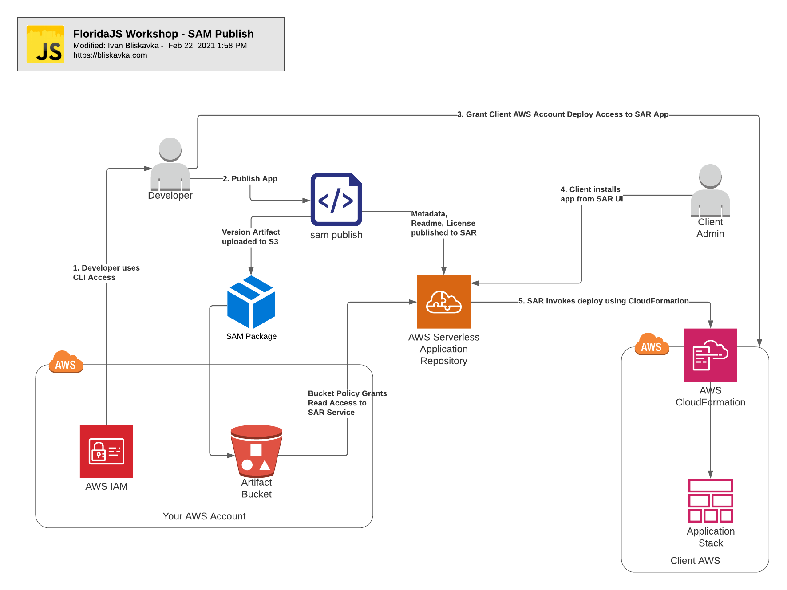

# FloridaJS Presentation 2/23/2021

## Slide 1: Intro

- Hello everyone, thank you for joining me to today for my first, and hopefully not last FloridaJS presentation
- Today we are going to cover the basics of running and deploying a 3 tier web application on AWS serverless technologies.
- But first, let me introduce myself.

## Slide 2: Ivan Bliskavka

- When I was a kid I wanted to be an inventor like Edison or Tesla; but I ended up playing way too many video games.
- Eventually, I discovered software engineering and to me creating software is invention.
- Some other hobbies: crossfit, house remodels, and making apps.
- I am a team lead at VoiceFoundry, which integrates Amazon Connect, a cloud based call center
- I am not representing VoiceFoundry today, but I am quite proud of this company so I am shamelessly plugging it anyway
- We are a consultancy so we see a lot of the same requirements over and over, which allows us to create app and deployment patterns.
- I would like to share the classic 3 tier web application pattern (presentation, application, data), based on AWS Serverless technologies

## Slide 3: Effort vs Work

- Before jumping into the presentation, let's clear something up
- Effort is not work
- If you are running virtual machines, you need to keep them in sync and patched
- If you are running physical servers, you are patching AND need someone on call in case a disk fails at 3 am
- When referring to the services provided by AWS, Werner Vogels, CTO @Amazon coined the term: Undifferentiated Heavy Lifting
- Undifferentiated means it has no effect on what makes YOUR app special
- So what I am trying to say is: What makes YOUR app special is work, everything else is effort
- Serverless technologies handle the heavy lifting of building a scalable and performant application, and lets you focus on what makes your app special
- I believe that the most dangerous part of the app is my code, leaning on proven open source libraries and managed services lets me reduce the risk.

## Slide 4: What is Serverless

- It's a buzzword, and it seams to be popping up in marketing everywhere
- It means different things to different things to different people, but for the sake of this conversation
- Serverless means using on-demand, auto-scaling, managed services, rather than maintaining your own infrastructure
- To me it means I pay for what I use and I am not being charged per hour of uptime.
- It means no minimum usage charges, and easy scaling if my app goes viral
- In reality, not every application will be purely serverless, but it's a good goal to have

## Slide 5: The DERN Stack

- This is the application architecture we will be looking at today
- The presentation tier is implemented in React
- The application tier is implemented in Express
- The data tier is Dynamo DB (a NoSql database) and S3 (an object/file store)
- In between, are the AWS services that make this work
  - Cognito is our user management service. It can support MFA and federation with social identity providers like facebook, and enterprise IDPs using SAML 2.0 Federation, such as Azure AD.
  - Amazon Route 53 is the DNS service. Today's code doesnt actually implement the routes since your app may be using a different DNS service
  - AWS Certificate Manager provides free, auto-renewing SSL for AWS Managed services
  - Amazon CloudFront is the CDN. It's essentially a proxy for your API and React Application and provides SSL termination and unified domain alias
  - The compiled React application is stored in a Amazon S3 bucket
  - API GW is essentially our managed web server, it proxies the HTTPS events to AWS Lambda
    - API GW comes with AWS Shield Basic DDOS protection
  - AWS Lambda is our compute-on-demand service. It is hosting our Express application
    - AWS Lambda can automatically scale to up to 1000 concurrent executions. Lambda is essentially tiny containers that run for about 15 minutes. Once the spike subsides, the containers are recycled.
    - You dont have to run a full Express application, Lambda can respond to raw API GW requests, but I chose do demo in express because it has a better local development experience
- Do we need an acronym
  - Mongo, Express, Angular, Node = MEAN
  - Mongo, Express, React, Node = MERN
  - Dynamo, Express, React, Node = DERN? Lol

### Stack Diagram

## Slide 6: SAM Deploy

- The deployment process is just as important as the application code
- and user error tends to be the most common and preventable deployment risk
- AWS CloudFormation allows you to provision infrastructure in a declarative YAML syntax.
- In your day-to-day development, you will use the SAM CLI, which will generate a CloudFormation package and deploy it directly to AWS.

### SAM Deploy

## Slide 7: SAM Package

- You should generate a SAM Package for your production builds
- This allows you to deploy the SAME build to multiple environment, or share it with clients
  - In my experience enterprise customers prefer to run apps in their OWN AWS account
- Additionally, it allows you to install a specific version of the application without rebuilding it

### SAM Package

## Slide 8: SAM Publish

- The last deployment mechanism provided by SAM is Publish
- This is essentially the SAM Package process, but it also publishes the app Meta Data to Serverless Application Repository
- Think of this as an AWS App catalog. There is no mechanism for charging for the apps, but its a great way to share public or private apps

### SAM Publish

